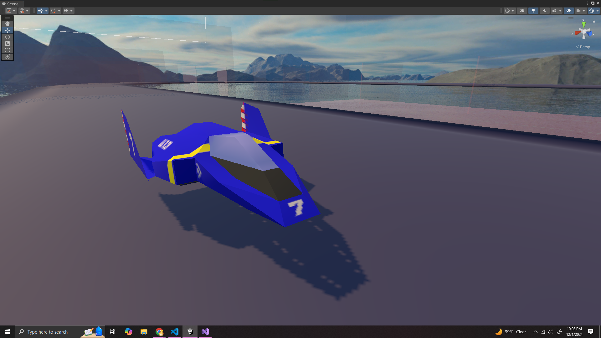
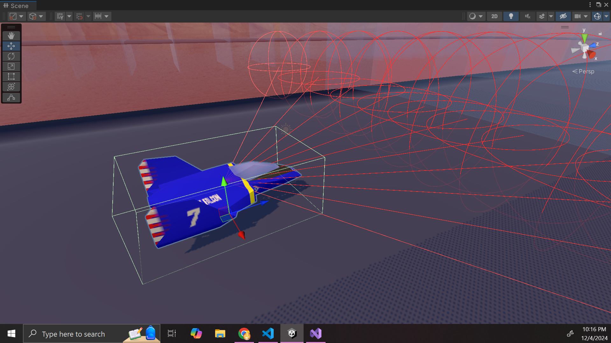
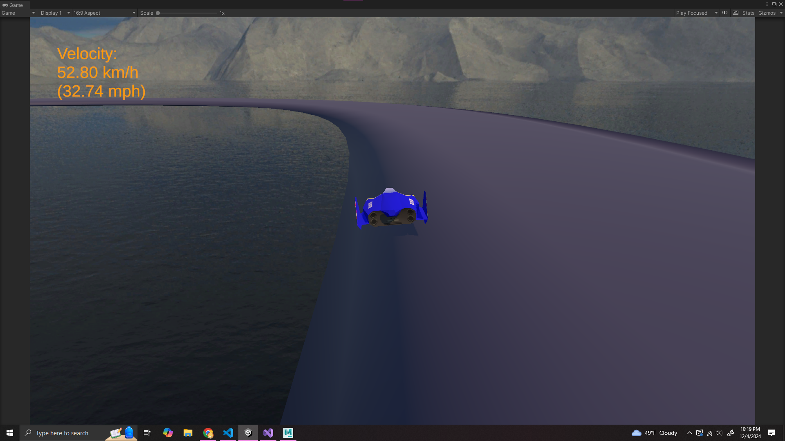
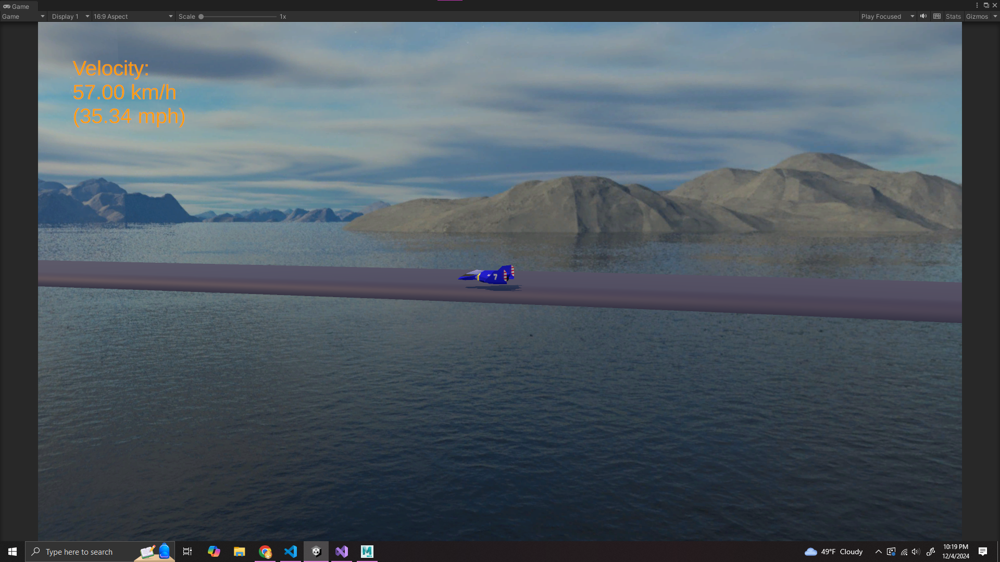
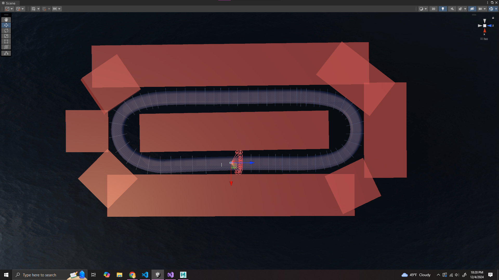
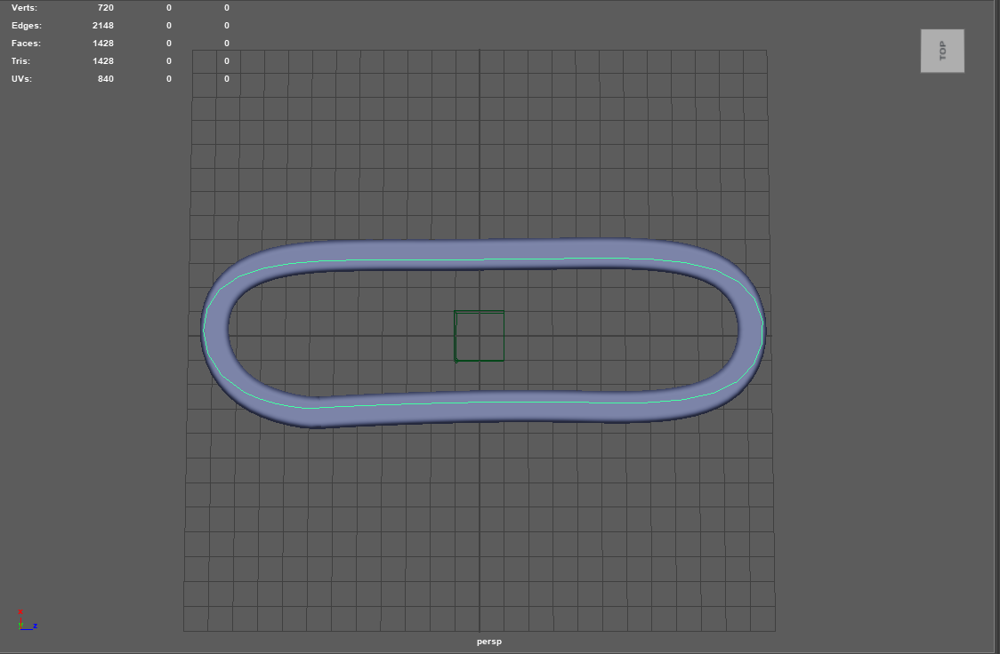
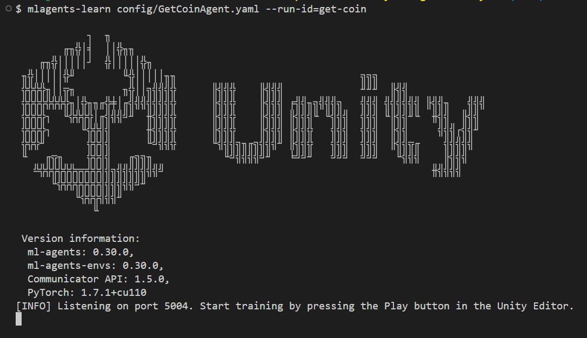
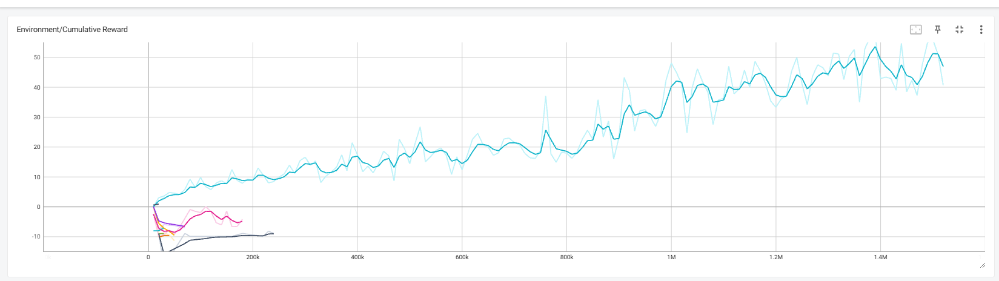
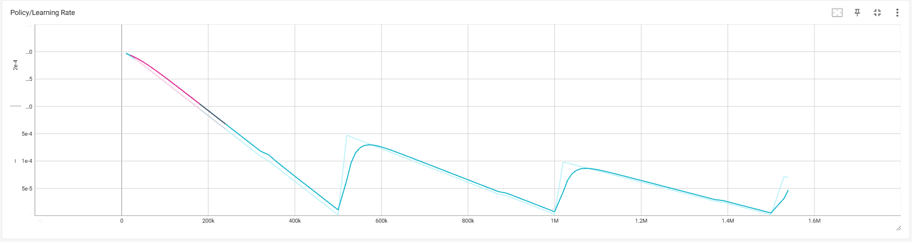

# Unity-RL
A prototype demonstrating reinforcement learning (PPO) and imitation learning (GAIL, BC) focusing on NPC behavior in autonomous driving with Unity ML-Agents. 

|RL-trained NPC drivers race each other over the sea!|
|:--:|
||

## The agents
|Vehicle|Perception sensors|
|:--:|:--:|
|||

The vehicle game object has several C# scripts attached deriving from classes in the ML-Agents package. ML-Agent classes define the NPC behavior including observations from sensors, actions from actuators, and handling rewards events. My goal was to train the vehicles to stay on the track without falling off, thus my rewards involved following checkpoints in order on the track, as well as penalties for falling off or getting too close to the edge of the track.

## Game design
### Gameplay
|Cam 1|Cam 2|
|:--:|:--:|
|||

While the goal of this project is to train NPC agents to play the game itself, I have also implemented input processing to allow users to play the game as well. This is required for testing the simulation, as well as training with heuristics for imitation learning. 

### Controls
| Button | Action |
|:--|:--|
|Fire1 (LMB, square-button @ PS4)| Accelerate|
|Fire2 (RMB, x-button @ PS4)| Brake|
|Horizontal Axis (AD, Arrows, Analog Stick)| Steer|
|Tab| Change camera view|

### Track design
|Unity view| Autodesk Maya view|
|:--:|:--:|
|||

I designed the track in Autodesk Maya using spline tools. This is because I am using Unity 2021, thus I do not have access to the spline package that is compatible with Unity 2022 and newer. After converting the spline to a paint effect then to a polygon, I imported it into Unity and setup the simulation environment. I included triggers for checkpoints and barriers to indicate where the NPC would be rewarded and penalized for training.

## Requirements
* Unity 2021.3 
* Python 3.8.13
* PyTorch 1.7.1 (with CUDA 11.0)
* ML-Agents 0.30.0

To run the project, first clone this repository, then: 

### Download Unity
Use Unity 2021.3. You can download it from Unity Hub, which can be installed from the <a href="https://unity.com/releases/editor/archive">Unity website</a>.

### Download Python and create a virtual environment
I struggled to get this project to work with any version of Python other than Python 3.8.13 (because I am using an older version of Unity). Originally you could download the Windows installer from the <a href="https://www.python.org/downloads/release/python-3813/">Python website</a>. If you have a 64-bit machine, it is highly recommended you select the x86-64 installer. However, Python does not provide binary installers for this version anymore; you can download the installer from <a href="https://github.com/adang1345/PythonWindows/tree/master?tab=readme-ov-file">this GitHub repository</a>. 

Then create a virtual environment using Python 3.8.13 inside of the root of the Unity project directory (the Unity RL folder you just cloned):
```bash
$ [YOUR_PATH]\\Python\\Python38\\python.exe -m venv [YOUR_VENV_NAME]
```

Then activate the venv:
```bash
$ [YOUR_VENV_NAME]\\Scripts\\activate
$ source [YOUR_VENV_NAME]\\Scripts\\activate
```

Then confirm that the venv has been created for the correct Python version:
```bash
$ python --version
Python 3.8.13
```

And upgrade pip using Python 3.8.13:
```bash
$ python -m pip install --upgrade pip
```

### Install PyTorch
```bash
$ pip3 install torch~=1.7.1 -f https://download.pytorch.org/whl/torch_stable.html
```

### Install ML-Agents
```bash
$ python -m pip install mlagents==0.30.0
```

### Troubleshooting ML-Agents dependency issues
Verify that ML-Agents has been installed correctly using the command:
```bash
$ mlagents-learn --help
```

A list of command line arguments should display. If you get errors, then here is how I fixed it:

I had to downgrade ProtoBuf,
```bash
$ pip install protobuf==3.20
```

And install the six package:
```bash
$ python -m pip install six 
```

Doing this fixed the dependency and version errors for ML-Agents.

### Installing CUDA (Optional)
You probably won't need to do this, I didn't, because I already have CUDA and even if I didn't I don't think a separate download is required anymore for ML-Agents 0.30.0. But just in case, if running the mlagents-learn --help command generated warnings about missing CUDA libraries, you may ignore this if you only want to use the CPU for processing. 

If you get these warnings and do have an NVIDIA GPU and want to use CUDA, you can download the CUDA Toolkit from the <a href="https://developer.nvidia.com/cuda-11.0-download-archive">NVIDIA download page</a>. If you still get warnings about cuDNN, you may install it from the <a href="https://developer.nvidia.com/cudnn">cuDNN page</a> and copy the include, lib, and bin folders into the CUDA v11.0 folder. 

## Training
The following is the command to train a new agent. If you want to create a different agent, you may change the name of the config file and ID to appropriately match the agent you want to make.
```bash
$ mlagents-learn config/RaceAgent-Imitation.yaml --run-id=checkpoints
```

You may also resume from a previous run.
```bash
$ mlagents-learn config/RaceAgent-Imitation.yaml --run-id=checkpoints --resume
```

|If setup correctly, the Unity logo displays in the terminal.|
|:---:|
||

After executing that command, press play in the Unity Editor. For a more detailed tutorial on Unity ML-Agents, you may refer to <a href="https://youtu.be/zPFU30tbyKs?si=3NZKsF10uKQ8k1f2">this excellent video</a> by Code Monkey or <a href="https://github.com/Unity-Technologies/ml-agents">the documentation</a>. 

## Visualization
To evaluate the model, you may view the metrics using TensorBoard DURING training from another terminal. You must be in the virtual environment. If you get warnings about TensorFlow installations, you can ignore these. Installing or updating TensorFlow may uninstall the needed versions of certain libraries like NumPy, ProtoBuf, etc for ML-Agents to work, and you will have to reinstall those compatible versions. 

As long as you see the localhost link, it should work. Open the localhost link in a web browser to see useful visualizations of the machine learning model.
```bash
$ tensorboard --logdir results
Serving TensorBoard on localhost; to expose to the network, use a proxy or pass --bind_all
TensorBoard 2.13.0 at http://localhost:6006/ (Press 
CTRL+C to quit)
```
|Rewards/Losses|Policy|
|:---:|:---:|
|||

## Imitation learning
Generative Adversarial Imitation Learning (GAIL) can be used to speedup RL training. How it works is, I record a gameplay session so the agent can view how it is supposed to play (rather than randomly guessing via trial and error). GAIL creates a second learning algorithm (discriminator) to determine whether an action comes from the agent or my demo. The agent must learn to behave more like the demo to deceive the discriminator. Behavioral Cloning (BC) may also be added to force the agent to act like the demo. Adding these to a project involves editing the config file to support additional learning types and parameters.

## Contributors
### Nicholas Wile
Kennesaw State University Department of Computer Science.

## Additional resources

### Unity ML-Agents Package
Unity Technologies. (2023). *Unity Machine Learning Agents*.  https://github.com/Unity-Technologies/ml-agents


Unity Manual ML-Agents Documentation. https://docs.unity3d.com/2021.3/Documentation/Manual/com.unity.ml-agents.html


### Research
J. Schulman, F. Wolski, P. Dhariwal, A. Radford, and O. Klimov, "Proximal Policy Optimization Algorithms," arXiv preprint arXiv:1707.06347, Jul. 2017. Available: https://arxiv.org/abs/1707.06347.

A. Juliani et al., "Unity: A General Platform for Intelligent Agents," arXiv preprint arXiv:1809.02627, Sep. 2018. Available: https://arxiv.org/abs/1809.02627.

J. Ho and S. Ermon, "Generative Adversarial Imitation Learning," arXiv preprint arXiv:1606.03476, Jun. 2016. Available: https://arxiv.org/abs/1606.03476.

A. Kumar et al., "When Should We Prefer Offline Reinforcement Learning Over Behavioral Cloning?" arXiv preprint arXiv:2204.05618, Apr. 2022. Available: https://arxiv.org/abs/2204.05618.

B. R. Kiran et al., "Deep Reinforcement Learning for Autonomous Driving: A Survey," in IEEE Transactions on Intelligent Transportation Systems, vol. 23, no. 6, pp. 4909-4926, June 2022, doi: 10.1109/TITS.2021.3054625. Available: https://ieeexplore.ieee.org/document/9351818

### Setting up ML-Agents
Code Monkey. (2020). Machine Learning AI in Unity (ML-Agents). [Playlist]. https://youtube.com/playlist?list=PLzDRvYVwl53vehwiN_odYJkPBzcqFw110&si=Tu09jWHK0A4V7LEl
* A fantastic playlist by Code Monkey to help you get started with setting the software up, defining agent behaviors in C# scripts, and designing simulation environments.

## Assets
All assets are original and created by me except for the F-Zero machines, which are all from The VG Resource, and the skybox, which is a cubemap I got from LearnOpenGL. My project is 100% free.

### The VG Resource
The VG Resource. (2024). https://www.vg-resource.com/ 

#### F-Zero Machines
Peardian. https://www.models-resource.com/submitter/Peardian/
* I used the <a href="https://www.models-resource.com/wii/supersmashbrosbrawl/model/6926/">old models</a>. One of the <a href="https://www.models-resource.com/wii/supersmashbrosbrawl/model/6986/">newer ones</a> is in my project files, but I did not use yet.

#### F-Zero GX Tracks 
Electropolitan. https://www.models-resource.com/submitter/Electropolitan/
* I did not use yet, but <a href=" https://www.models-resource.com/gamecube/fzerogx/model/25632/">Mute City</a> is in my project files.

### LearnOpenGL
LearnOpenGL. https://learnopengl.com/
* High definition <a href="https://learnopengl.com/Advanced-OpenGL/Cubemaps">cubemap</a>